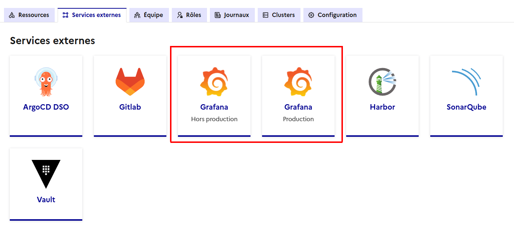
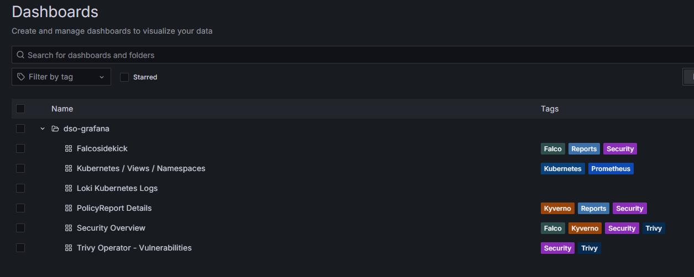
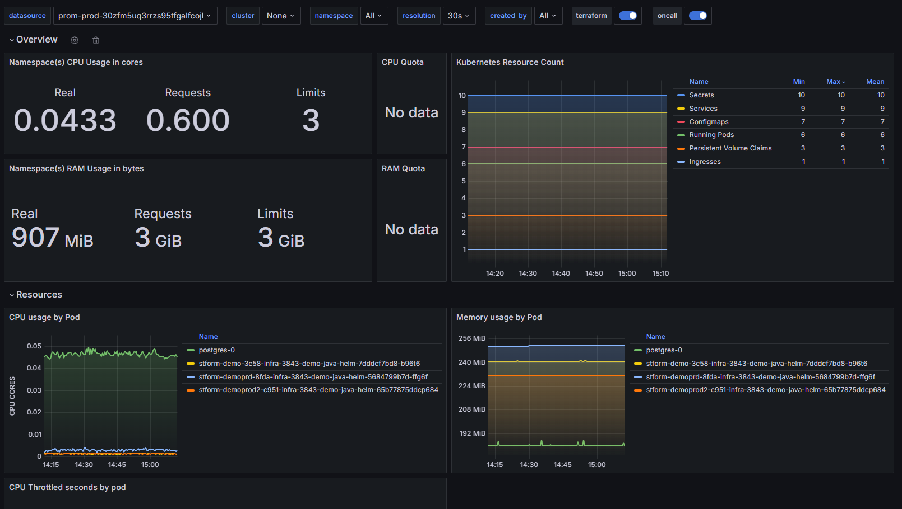

# Observabilité sur CPiN

## Grafana

Prerequis : avoir une application déployée sur CPiN.

### Accès

Depuis la console CPiN aller sur son projet puis sur l'onglet `Services Externes`. Cliquez sur la tuile Grafana correspondant à son environnement :
 - Grafana Production : Accès aux logs et métriques des environnements de type production
 - Grafana Hors production : Accès aux logs et métriques des environnements de type différent de production (dev, staging, etc.)

> Attention, le type d'environnement est déterminant sur la façon de consommer l'observabilité.

### Accès aux dashboards par défaut

Une fois l'instance Grafana sélectoinnée, allez dans le menu gauche dashboard. 

Dans le menu qui s'affiche différents dashboard sont accessibles :
 - Falcosidekick : Métriques concernant les indicateurs falco (détection de comportement étragne sur les PODs)
 - Kubernetes / Views / Namespaces : Métriques sur la consommation de ressources système CPU/RAM etc. 
 - Loki Kubernetes logs : Accès aux logs applicatives (tout ce qui est envoyé sur stdout / stderr sur les PODs)
 - PolicyReport Details : Métriques concernant les indicateurs Kyverno (respect des contraintes CPiN sur les manifests, par exemple la présence de labels, etc.)
 - Trivy Operator - Vulnerabilities : Métriques concernant les indicateurs Trivy (présence de CVE sur les containers)
 - Security overview : Dashboard synthétique des indicateurs Kyverno, Falco et Trivy

> A noter que certains comportements peuvent différer entre PAX et le MI, notamment certains dashboard peuvent ne pas fonctionner sur PAX.

Exemple de remontée de métriques:

### Ajout de dashboard custom

CPiN intègre une fonctionnalité de *Dashboard as code*.

Lors de la création d'un projet, un repo de code est automatiquement créé dans gitlab : infra-observability

Ce repo de code peut contenir 2 types de fichiers :
 - Des Dashboard grafana sous forme de fichiers .json dans le répertoire "/files/dashboards/"
 - Des alertes sous la forme de fichiers .yaml.tpl  dans le répertoire /files/rules/

Les fichiers présents dans ces répertoires sont automatiquement déployés dans grafana (peut prendre jusqu'à 3 minutes pour se synchroniser).

Afin de sauvegarder un dashboard dans Cloud Pi Native, il est nécessaire d'exporter le contenu JSON d'un dashboard depuis Grafana puis de copier le contenu dans un fichier /files/dashboards/mondashboard.json.

Pour cela depuis un dashboard cliquez sur *share* :

Puis *Export* et *View JSON*

Enfin cliquez sur Copy to Clipboard

La synchronisation du repo de code gitlab *infra-observability* vers *Grafana* se fait via une *Application ArgoCD* nommée [env]-[projet]-observability :

Un objet de type Kubernetes *GrafanaDashboard* est créé pour chaque dashboard créé *as code*. En cas d'erreur sur le contenu du JSON, les erreurs seront visibles depuis cet objet via ArgoCD.

> À noter que seule la branche **main** est synchronisée

La video suivante illustre cette fonctionnalité

<video width="640" height="480" controls>
  <source src="https://cpin-public-ressources.s3.fr-par.scw.cloud/documentation/cloud-pi-native/dashboard-as-code.mp4" type="video/mp4" />
</video>

