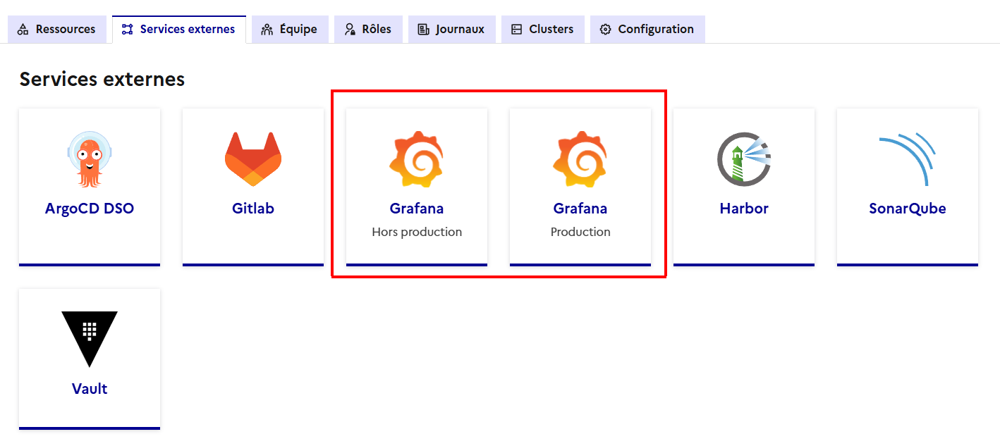
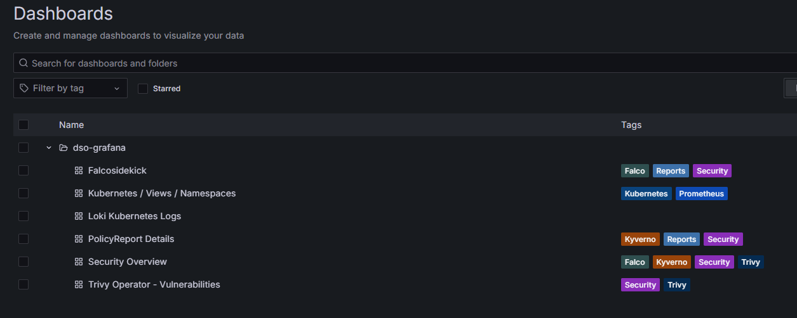
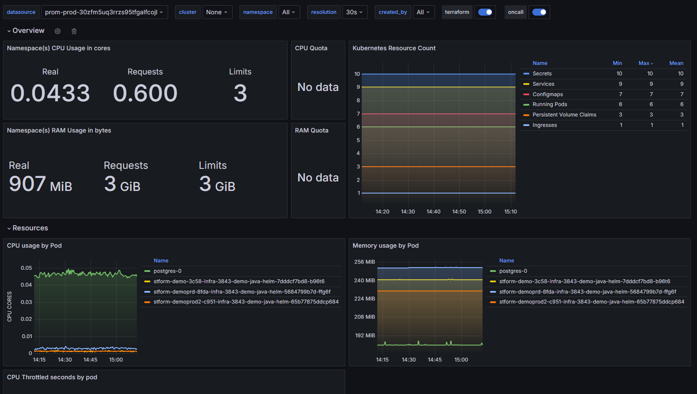
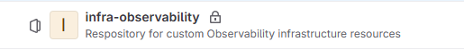
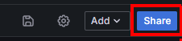
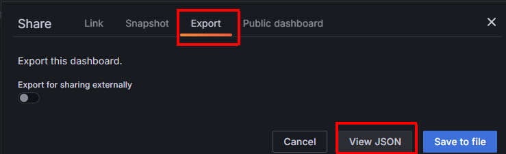
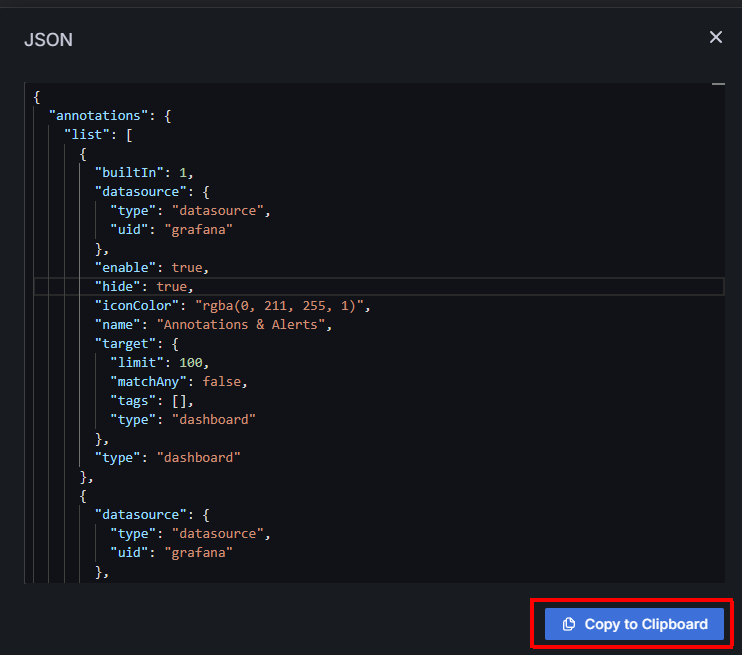
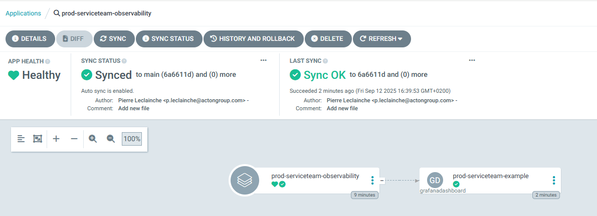

# Observabilité sur CPiN

Vous en êtes à l'étape 6 de la formation CPiN :

1. [Gestion des projets CPiN](https://github.com/cloud-pi-native/formation-cpin-gestion-projet)
2. [Application d'exemple pour déploiement sur CPiN](https://github.com/cloud-pi-native/formation-cpin-repo-applicatif/tree/tuto)
3. [Gestion des artefacts sur CPiN](https://github.com/cloud-pi-native/formation-cpin-harbor-trivy)
4. [Chart Helm de démonstration sur CPiN](https://github.com/cloud-pi-native/formation-cpin-deploiement)
5. [Gestion des secrets sur CPiN](https://github.com/cloud-pi-native/formation-cpin-gestion-secret)
6. ➡️ [Observabilité sur CPiN](https://github.com/cloud-pi-native/formation-cpin-observabilite)

## Grafana

> [!WARNING]
> Il est nécessaire d'avoir déployé une application sur CPiN pour poursuivre cette formation.

### Accès

▶️ Depuis la console CPiN, allez sur votre projet dans l'onglet **Services externes**. Cliquez sur la tuile **Grafana**
correspondant à votre environnement :

- **Grafana Production** : accès aux logs et métriques des environnements de type production
- **Grafana Hors production** : accès aux logs et métriques des environnements hors production (dev, staging, etc.)

> [!WARNING]
> Le type d'environnement est déterminant dans la façon de consommer l'observabilité.

▶️ Pour vous authentifier, sélectionnez **Sign in with grafana-projects**.

### Accès aux dashboards par défaut

▶️ Allez dans le menu **Dashboards** sur la gauche, puis ouvrez le dossier **dso-grafana**.

Différents dashboards par défaut sont accessibles :

- **Falcosidekick** : métriques concernant les indicateurs Falco (détection de comportements suspects sur les pods)
- **Kubernetes / Views / Namespaces** : métriques sur la consommation de ressources système (CPU, RAM, etc.)
- **Loki Kubernetes logs** : accès aux logs applicatifs (tout ce qui est envoyé sur stdout / stderr par les pods)
- **PolicyReport Details** : métriques concernant les indicateurs Kyverno (respect des contraintes CPiN sur les
  manifests, par exemple la présence de labels)
- **Trivy Operator - Vulnerabilities** : métriques concernant les indicateurs Trivy (présence de CVE sur les
  conteneurs)
- **Security overview** : dashboard synthétique des indicateurs Kyverno, Falco et Trivy

> [!WARNING]
> Certains comportements peuvent différer entre PAX et MI : certains dashboards peuvent notamment ne pas fonctionner
> sur PAX.

Exemple de remontée de métriques :

### Ajout de dashboards custom

CPiN intègre une fonctionnalité de *Dashboard as Code*.

Pour rappel, lors de la création d'un projet, un dépôt de code **infra-observability** est automatiquement créé dans
GitLab.

Ce dépôt peut contenir 2 types de fichiers :

- des dashboards Grafana au format `.json` dans le répertoire `files/dashboards/`
- des alertes au format `.yaml.tpl` dans le répertoire `files/rules/`

Les fichiers présents dans ces répertoires sont automatiquement déployés dans Grafana. La synchronisation peut prendre
jusqu'à 3 minutes.

Le format JSON des dashboards étant complexe, il est recommandé de construire le dashboard directement dans
l'interface Grafana, ou de partir d'un dashboard existant, puis de l'exporter au format JSON et d'en copier le contenu
dans un fichier du répertoire `files/dashboards/`.

▶️ Depuis le dashboard, cliquez sur **Share** :

▶️ Puis sur **Export** et **View JSON** :

▶️ Enfin, cliquez sur **Copy to Clipboard** :

La synchronisation du dépôt GitLab **infra-observability** vers Grafana est assurée par une application ArgoCD nommée
`<env>-<projet>-observability` :

Un objet Kubernetes de type `GrafanaDashboard` est alors créé pour chaque dashboard présent dans le dépôt. Si le
contenu d'un fichier JSON est invalide, les erreurs sont visibles dans les événements de cet objet via ArgoCD.

> [!NOTE]
> Seule la branche **main** est synchronisée.

La vidéo suivante illustre cette fonctionnalité :
[dashboard-as-code.mp4](https://cpin-public-ressources.s3.fr-par.scw.cloud/documentation/cloud-pi-native/dashboard-as-code.mp4)

Bravo, vous avez terminé le dernier chapitre de la formation CPiN, consacré à l'observabilité !
